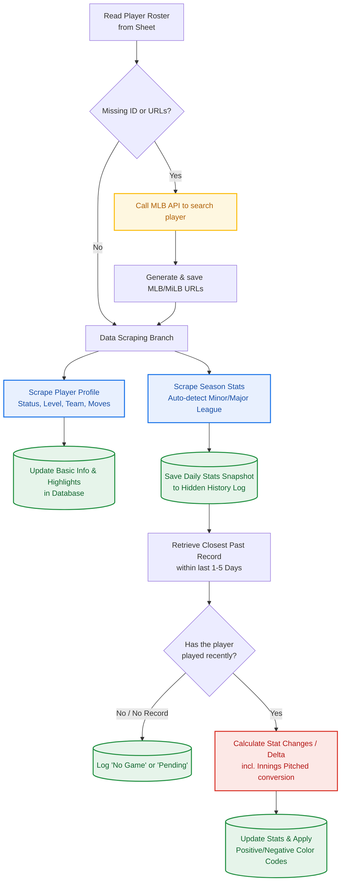

1.爬蟲與資料擷取 (Data Fetching & Scraping)
系統會先確認球員的基礎識別碼，再兵分兩路去撈取「狀態資訊」與「賽季數據」。
- API 補漏機制： 若清單中只有球員名字而沒有網址，系統會先呼叫 MLB 官方 API 查詢 Player ID 並自動補齊網址，確保後續爬蟲有目標可抓。
- 精準定位數據： scrapeDetailedStats 實作了很聰明的判斷邏輯。它會根據球員目前的層級（MLB 還是 MiLB），去尋找網頁表格中對應年份的 Regular Season 或 MLB/MiLB Stats 行，避免抓到春訓或生涯總計的無效數據。

2.資料庫更新與近況比對 (Database Update & Delta Calc)
抓回來的資料不僅要填入表格，系統還會建立「歷史快照」，用來計算近五天內的數據變化（Delta），讓報告更具洞察力。
- 歷史快照庫 (Stats_History)： 將當天的數據序列化成 JSON 隱藏儲存，避免試算表欄位過度膨脹。
- 投球局數 (IP) 演算法： 棒球的局數進位是 0.1, 0.2 接著跳整數，這裡特別針對 calcIPDiff 做了處理（先轉成出局數，相減後再轉回局數），這是非常專業的細節處理。

