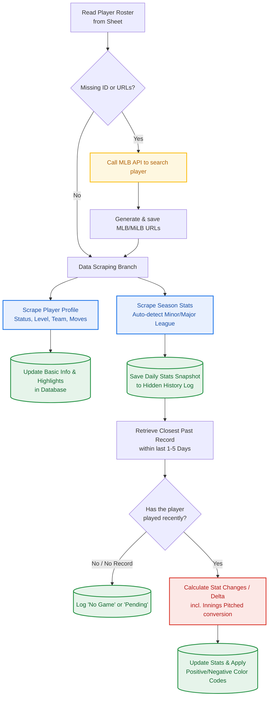

```mermaid
graph TD
    classDef api fill:#fef7e0,stroke:#fbbc04,stroke-width:2px,color:#b06000;
    classDef scrape fill:#e8f0fe,stroke:#1a73e8,stroke-width:2px,color:#174ea6;
    classDef sheet fill:#e6f4ea,stroke:#1e8e3e,stroke-width:2px,color:#0d652d;
    classDef calc fill:#fce8e6,stroke:#d93025,stroke-width:2px,color:#b31412;

    A[Read Player Roster<br/>from Sheet] --> B{Missing ID or URLs?}
    
    B -- Yes --> C[Call MLB API to search player]:::api
    C --> D[Generate & save MLB/MiLB URLs]
    
    B -- No --> E[Data Scraping Branch]
    D --> E
    
    E --> F[Scrape Player Profile<br/>Status, Level, Team, Moves]:::scrape
    E --> G[Scrape Season Stats<br/>Auto-detect Minor/Major League]:::scrape
    
    F --> H[(Update Basic Info & Highlights<br/>in Database)]:::sheet
    
    G --> I[(Save Daily Stats Snapshot<br/>to Hidden History Log)]:::sheet
    I --> J[Retrieve Closest Past Record<br/>within last 1-5 Days]
    
    J --> K{Has the player<br/>played recently?}
    
    K -- No / No Record --> L[(Log 'No Game' or 'Pending')]:::sheet
    K -- Yes --> M[Calculate Stat Changes / Delta<br/>incl. Innings Pitched conversion]:::calc
    
    M --> N[(Update Stats & Apply<br/>Positive/Negative Color Codes)]:::sheet
```
