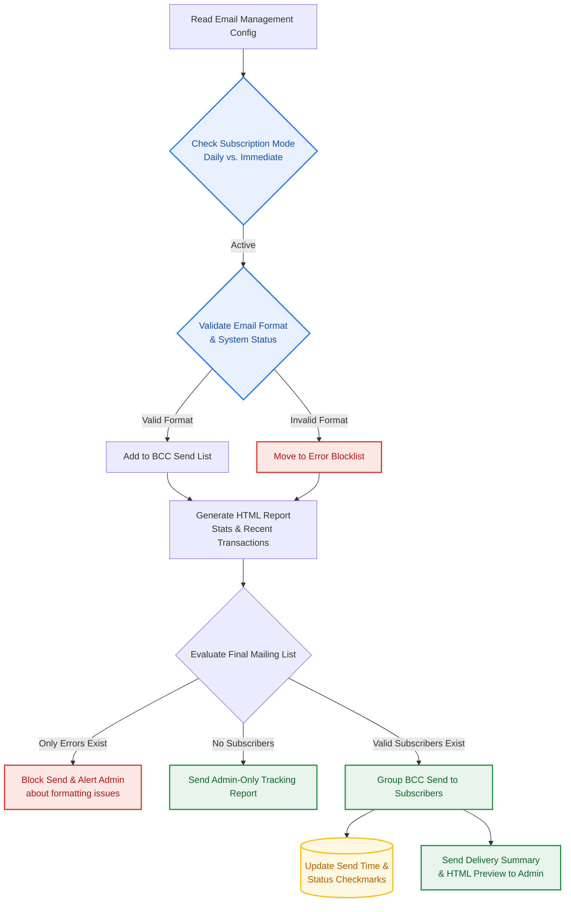

1.郵件寄送與防錯管理 (Email Management & Distribution)
將整理好的數據轉化為報表，並導入嚴格的「防錯與審查」機制，確保每次的群發都安全無虞。
- 即時防錯 (onEdit)： 這是系統最強健的設計之一。當你在試算表輸入信箱時，系統就已經即時糾正了 @gamil.com 這類手誤，大幅降低發信 API 報錯的機率。
- 安全攔截與審查： 寄送前會區分「合格收件人」與「格式錯誤者」。遇到錯誤時，系統並不會直接當機，而是會將錯誤者剔除，並發送信件通知管理員進場維護，確保其他正常訂閱者的權益不受影響。

