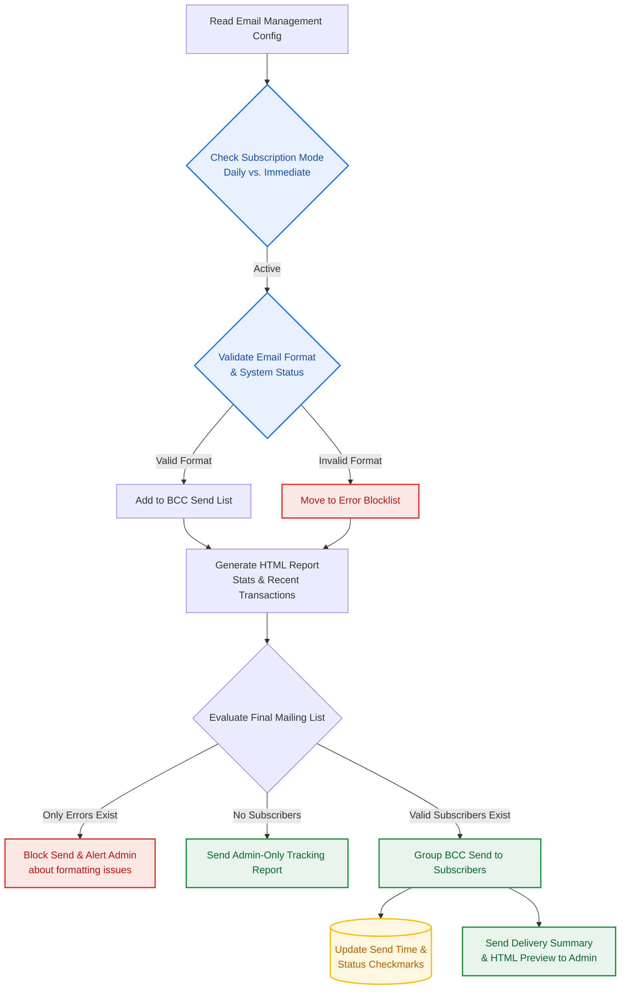

```mermaid
graph TD
    classDef check fill:#e8f0fe,stroke:#1a73e8,stroke-width:2px,color:#174ea6;
    classDef mail fill:#e6f4ea,stroke:#1e8e3e,stroke-width:2px,color:#0d652d;
    classDef error fill:#fce8e6,stroke:#d93025,stroke-width:2px,color:#b31412;
    classDef sheet fill:#fef7e0,stroke:#fbbc04,stroke-width:2px,color:#b06000;

    A[Read Email Management Config] --> B{Check Subscription Mode<br/>Daily vs. Immediate}:::check
    
    B -- Active --> C{Validate Email Format<br/>& System Status}:::check
    
    C -- Invalid Format --> D[Move to Error Blocklist]:::error
    C -- Valid Format --> E[Add to BCC Send List]
    
    E --> F[Generate HTML Report<br/>Stats & Recent Transactions]
    D --> F
    
    F --> G{Evaluate Final Mailing List}
    
    G -- Only Errors Exist --> H[Block Send & Alert Admin<br/>about formatting issues]:::error
    G -- No Subscribers --> I[Send Admin-Only Tracking Report]:::mail
    G -- Valid Subscribers Exist --> J[Group BCC Send to Subscribers]:::mail
    
    J --> K[(Update Send Time &<br/>Status Checkmarks)]:::sheet
    J --> L[Send Delivery Summary<br/>& HTML Preview to Admin]:::mail
```
